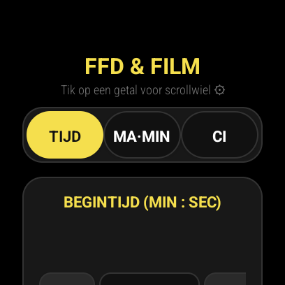
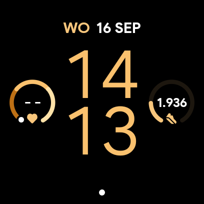
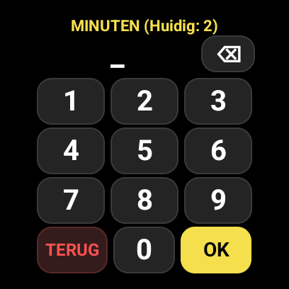

# RT Focus & Film Calculator — Google Pixel Watch 3 & Wear OS App

Een speciaal ontworpen **Wear OS** applicatie voor de **Google Pixel Watch 3** (41mm en 45mm, 456x456 px) en andere Wear OS smartwatches, gebaseerd op de Niet-Destructief Onderzoek (NDO / RT - Radiografisch Onderzoek) focusverandering berekeningen.

<p align="center">
  
  &nbsp;&nbsp;
  
  &nbsp;&nbsp;
  
</p>

---

## 🚀 Direct Downloaden & Installeren

👉 **[Download kant-en-klare APK (dist/focusverandering-wear.apk)](dist/focusverandering-wear.apk)** *(~530 KB)*

Je hoeft niets te compileren! Kies hieronder hoe je de app wilt installeren:

### Optie 1: Direct via je Android Telefoon (Zonder PC) — *Meest eenvoudig!*
1. Download `focusverandering-wear.apk` op je smartphone.
2. Installeer een Wear OS sideload app op je telefoon uit de Google Play Store:
   - **GeminiMan Wear OS Manager** (Aanbevolen)
   - **Wear Installer 2**
   - **Bugjaeger Mobile ADB**
3. Volg de instructies in de app om draadloos te koppelen met je watch en installeer direct de APK!

---

### Optie 2: Automatisch via PC/Mac (Wi-Fi)

#### Op Linux / macOS:
```bash
./install-watch.sh
```

#### Op Windows:
Dubbelklik op **`install-watch.bat`** of voer uit in de terminal:
```cmd
install-watch.bat
```

Het script begeleidt je stap voor stap:
1. Activeer ontwikkelaarsopties op je horloge: **Instellingen** ➔ **Systeem** ➔ **Info** ➔ **Versies** ➔ tik **7 keer** op **Build-nummer**.
2. Schakel **ADB-foutopsporing** en **Draadloos foutopsporing** IN onder **Ontwikkelaarsopties**.
3. Voer het IP-adres en de poort in wanneer het script erom vraagt. De app wordt direct op je horloge geïnstalleerd en geopend!

---

### Optie 3: Handmatig via ADB Commandline
```bash
# 1. Koppel met je horloge (indien vereist):
adb pair <HORLOGE_IP>:<PAIR_PORT> <PAIR_CODE>

# 2. Verbind met het horloge:
adb connect <HORLOGE_IP>:<CONNECT_PORT>

# 3. Installeer de APK:
adb install -r -t dist/focusverandering-wear.apk

# 4. Start de app op de watch:
adb shell am start -n com.rt.focuswatch/.MainActivity
```

---

## ⌚ Belangrijkste Functies op je Pols

1. **Rond 456x456 AMOLED Design**:
   - Diepzwart (`#000000`) voor minimaal batterijverbruik op het OLED-scherm.
   - Ronde veilige marges (geen afgekipte hoeken of randen).
   - Grote, handschoenvriendelijke knoppen en steppers.
2. **Rotary Crown Ondersteuning**:
   - Draai aan de fysieke kroon van de Pixel Watch 3 om soepel door de invoervelden en kaarten te scrollen.
3. **Drie Invoermodi**:
   - **Tijd**: Directe minuten en seconden (met snelle presets: 30s, 1m, 2m, 3m, 5m).
   - **mA · min**: Automatische berekening van belichtingstijd uit $mA \cdot min$ en buisstroom ($mA$).
   - **Ci Bronwissel**: Automatische halfwaardetijd-vervalberekening voor **Se-75** (120 dagen) en **Ir-192** (74 dagen) vanaf kalibratiedatum naar vandaag.
4. **FFD Kwadratenwet**:
   - $t_2 = t_1 \times \left(\frac{FFD_2}{FFD_1}\right)^2$ met presets (70, 80, 90, 100, 120 cm).
5. **Filmsoort Conversie**:
   - Converteert direct tussen **D4**, **D5** en **D7** filmsnelheden.
6. **Materiaalfactoren Database**:
   - 89 materialen (o.a. Koolstofstaal, RVS 304/316, Duplex 2205, Inconel 625, Hastelloy C-276, Titanium, Koper) met buisspanning-keuze (**150 kV**, **200 kV**, **250 kV**, **300 kV**).
7. **⏱ Ingebouwde Pols-Belichtingstimer**:
   - Na het berekenen tik je met 1 druk op **"Start Timer"**.
   - Een ronde voortgangsring telt af op je pols.
   - Bij afloop trilt het horloge intensief (haptische feedback) en klinkt een signaal.
8. **100% Offline & Standalone**:
   - Werkt volledig autonoom in de bunker, leidingstraat of donkere kamer zonder telefoon of internetverbinding.

---

## 📁 Mapstructuur

```
focus-watch/
├── app/                          # Wear OS web-app broncode (HTML/CSS/JS)
│   ├── index.html                # Rond horloge-interface
│   ├── style.css                 # Wear OS 456x456 styling
│   ├── app.js                    # Rekenlogica, timer en kroonbesturing
│   ├── data.js                   # 89 materialen + bronnenlijst
│   ├── manifest.json             # PWA manifest
│   ├── service-worker.js         # Offline cache
│   └── icon.png                  # Horloge launcher icoon
│
├── simulator/                    # Interactieve Pixel Watch 3 simulator
│   └── simulator.html            # Testomgeving voor in de browser
│
├── android/                      # Native Android Wear OS project (Gradle / Android Studio)
│   ├── app/                      # Android app module
│   │   └── src/main/java/        # MainActivity.java (Rotary + Haptics bridge)
│   ├── build.gradle              # Android build configuratie
│   └── settings.gradle
│
├── dist/
│   └── focusverandering-wear.apk # Kant-en-klaar gecompileerde Wear OS APK
│
├── screenshots/                  # Screenshots van interface op de Pixel Watch 3
├── tools/                        # Compilatie- en buildhulpmiddelen
│   ├── build-apk.sh              # Automatisch standalone compilatiescript
│   └── wear-tiles-libs/          # Android Wear OS bibliotheken
│
├── install-watch.sh              # Linux / macOS installatiescript via Wi-Fi ADB
├── install-watch.bat             # Windows installatiescript via Wi-Fi ADB
├── test-simulator.sh             # Start interactieve browser simulator
└── README.md
```

---

## 🖥 Testen in de Browser (Simulator)

Je kunt de horloge-app direct testen op je computer via de interactieve Pixel Watch 3 simulator:

```bash
./test-simulator.sh
```

Dit opent een webserver op `http://localhost:8089/simulator/simulator.html`.

In de simulator kun je:
- De app bedienen in een realistische **Pixel Watch 3 horlogekast**.
- Met het **muiswiel** of door de **fysieke kroon aan de zijkant** te draaien/klikken scrollen.
- Snelle testscenario's uitvoeren (FFD 80→100, D4 naar D5/D7, Inconel 625, Ci-wissel).
- De polstimer en aftelring testen.

---

## 🛠 De APK Opnieuw Bouwen (Voor ontwikkelaars)

Als je aanpassingen maakt in `app/` (bijvoorbeeld extra materialen toevoegt of CSS wijzigt), kun je de APK opnieuw bouwen via:

```bash
./tools/build-apk.sh
```
Of open het project in **Android Studio** via de `android/` map.
